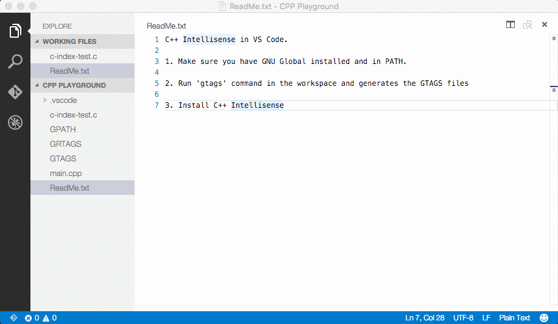

# README

C++ Intellisense 

Please go to [https://github.com/austin-----/code-gnu-global](https://github.com/austin-----/code-gnu-global) for source code, bug tracking, and feature request

## Functionality
Provide Intellisense for C/C++ with the help of the GNU Global tool in Visual Studio Code.

## Usage
1. Make sure you have the latest GNU Global (>= 6.5) tool installed and added to PATH. If you do not have GNU Global available in PATH, then please add `codegnuglobal.executable` to your settings.js (Preference - User Settings) and set its value to the absolute path and binary of `global` or `global.exe`.
   
   E.g.: (GNU Global on Windows, inside a MSYS2 installation)
   ```
   {
       'codegnuglobal.executable': "C:\\msys64\\usr\\bin\\global.exe"
   }
   ```
   
   Please note that Debian and its derivates (Ubuntu, Mint, ...) are shipping an outdated version of GNU global (v5.7), which is throwing the error "--encode-path unrecognized". (Thanks @badaix for the tip)

2. In the workspace folder of your C/C++ project, run 'gtags'. This will generate the GTAGS, GRTAGS, and GPATH files. If you made changes to your code, run 'gtags' again to renew the tag files.

   Upon saving your source code, the extension would try to automatically update the tags by running 'global -u'. You can turn this off by setting `codegnuglobal.autoupdate` to false in your settings.js (Preference - User Settings).

3. Install 'C++ Intellisense' in VS Code and then you can enjoy Intellisense for this project in VS Code.

4. If you are using Windows with a non-CP437 code page, or Linux/OSX with non-UTF8 encoding, please add 'codegnuglobal.encoding' to your settings.js (Preference - User Settings) and set its value to the custom encoding you are using (Please look at [https://github.com/ashtuchkin/iconv-lite/wiki/Supported-Encodings](https://github.com/ashtuchkin/iconv-lite/wiki/Supported-Encodings) for supported encodings).
   
   E.g.: (CP936 for Simplified Chinese on Windows)
   ```
   {
       'codegnuglobal.encoding': 'cp936'
   }
   ```

## Demo
* Go to definition



* Auto completion


* Find references


* List symbols


## Limitations
Since GNU Global is a tagging system, it does not do any AST parsing to understand class members and etc. 

### For more information
* [GNU Global](https://www.gnu.org/software/global/)
* [Repo](https://github.com/austin-----/code-gnu-global)
* [VS Code Marketplace](https://marketplace.visualstudio.com/items/austin.code-gnu-global)

**Enjoy!**
