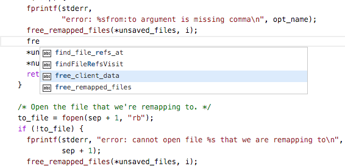
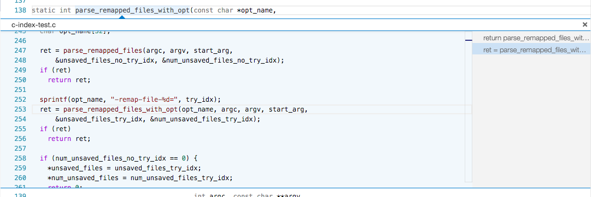
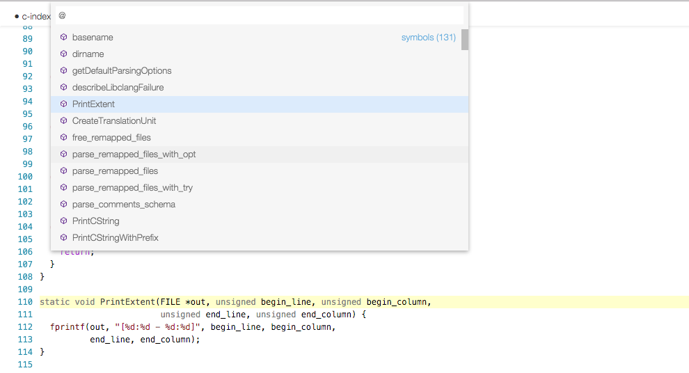

# README

[Github Repo](https://github.com/austin-----/code-gnu-global)

## Functionality
Provide Intellisense for C/C++ with the help of the GNU Global tool in Visual Studio Code.

## Usage
Make sure you have GNU Global tool installed and added to PATH. 

In the workspace folder of your C/C++ project, run 'gtags'. This will generate the GTAGS, GRTAGS, and GPATH files.

Then you can enjoy Intellisense for this project in VS Code:

* Auto completion

* Go to definition

* Find references

* List symbols

## Limitations
Since GNU Global is a tagging system, it does not do any AST parsing to understand class members and etc. 

### For more information
* [GNU Global](https://www.gnu.org/software/global/)
* [Repo](https://github.com/austin-----/code-gnu-global)

** Enjoy!**
